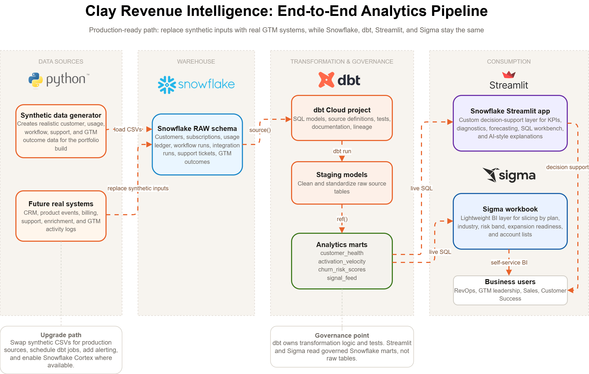

# Clay Revenue Intelligence

A Snowflake, dbt, Streamlit, and Sigma project that turns GTM usage, product adoption, pipeline, and churn-risk signals into business-ready revenue intelligence.

This project was built as a Clay-inspired analytics system to show how raw customer and product signals can be transformed into actionable insights for Revenue Operations, Sales, Customer Success, and GTM leadership.

---

## Live App

Public Streamlit app:

https://clay-revenue-intelligence.streamlit.app/

---

## Project Overview

GTM teams often have customer data spread across product usage, billing, CRM, support, and sales activity systems. The challenge is not just storing this data, but turning it into clear answers:

- Which accounts are expansion-ready?
- Which customers are showing early churn-risk signals?
- Which product behaviors are linked to stronger pipeline?
- What actions should Sales or Customer Success take next?
- How would revenue change if activation, adoption, expansion, or retention improved?

This project solves that by building an end-to-end revenue intelligence workflow:

1. Synthetic GTM data is generated to represent customer, product, usage, support, and revenue signals.
2. Snowflake stores the raw and analytics-ready data.
3. dbt transforms raw data into governed staging models and business marts.
4. Streamlit provides an interactive decision-support app.
5. Sigma provides a lightweight self-service BI layer for slicing and reporting.

---

## Architecture

The architecture is designed so synthetic inputs can later be replaced by real company data sources such as CRM, product events, billing, support tickets, enrichment logs, and GTM activity data.

```text
Synthetic or real GTM systems
        ↓
Snowflake RAW schema
        ↓
dbt staging models
        ↓
dbt analytics marts
        ↓
Streamlit decision-support app + Sigma BI dashboard
        ↓
Business users
```

Architecture diagram will be added here:



---

## Tech Stack

| Layer | Tools Used |
|---|---|
| Data warehouse | Snowflake |
| Transformation | dbt Cloud |
| App layer | Streamlit |
| BI layer | Sigma |
| Programming | Python, SQL |
| Data model | Synthetic GTM customer, usage, support, and revenue data |

---

## Key App Features

### Executive Overview

The overview tab gives GTM leaders a quick summary of the selected segment, including activation lift, Claygent adoption lift, expansion ARR opportunity, ARR at risk, and key findings.

### Why & How Diagnostic Layer

The app explains what is happening, why it may be happening, how the app knows, and what action the business should take next.

This helps move beyond dashboard reporting into decision support.

### Activation Analysis

This section compares early product activation patterns and shows whether customers who reach key usage milestones generate stronger pipeline outcomes.

### Expansion Analysis

This section identifies non-enterprise accounts that show enterprise-like behavior and may be ready for upsell.

It includes expansion candidate count, potential ARR uplift, average expansion score, top expansion candidates, and pipeline efficiency views.

### Churn Risk Analysis

This section identifies accounts that may need Customer Success attention based on churn-risk signals such as low pipeline efficiency, support friction, credit usage, product adoption, and workflow success patterns.

### Revenue Scenario Planner

The forecast tab lets users test directional what-if scenarios across GTM levers, including activation improvement, Claygent adoption improvement, expansion conversion, and high-risk account save rate.

### Signal Feed

The signal feed converts Snowflake metrics into prioritized GTM alerts with hypotheses and recommended actions.

### Analytics Workbench

The workbench lets technical users inspect analytical logic, run governed business queries, preview results, and download outputs.

### AI Analyst Layer

The AI Analyst tab explains the selected segment in plain English using only the Snowflake metrics shown in the app.

Because Snowflake Cortex LLM functions were not available in the trial environment, the app uses a deterministic fallback. In a paid Snowflake environment, the same grounded context can be passed to `AI_COMPLETE` for natural-language analysis.

---

## dbt Data Models

The dbt layer transforms raw GTM data into clean analytics-ready models.

| Model | Purpose |
|---|---|
| `stg_customers` | Cleans customer-level source data |
| `stg_usage_ledger` | Standardizes product usage and credit consumption data |
| `stg_workflow_runs` | Tracks workflow activity and success patterns |
| `customer_health` | Combines usage, pipeline, support, and adoption signals |
| `activation_velocity` | Measures early workflow adoption and activation behavior |
| `churn_risk_scores` | Scores accounts by churn-risk indicators |
| `signal_feed` | Converts business metrics into GTM alerts and recommendations |

The Streamlit app and Sigma workbook read from dbt-built Snowflake marts instead of raw tables.

---

## Sigma BI Dashboard

I also created a basic Sigma workbook connected to the dbt-built Snowflake marts. The purpose of this dashboard is not to replace the Streamlit app, but to show how the same governed Snowflake/dbt data layer can support a lightweight self-service BI experience.

The Sigma dashboard is intentionally simple for now and serves as a starting point for future BI enhancement. It demonstrates how business users could slice GTM data by plan tier, risk band, expansion readiness, ARR, and pipeline efficiency without writing SQL.

Live Sigma workbook:

https://app.sigmacomputing.com/uiuc/workbook/workbook-6Wn8xc4dzFN6rRXhNDtpMI?:link_source=share

Note: The live Sigma workbook may require Sigma workspace login/access.

A PDF export is included for public review:

[View Sigma Dashboard PDF](assets/sigma_dashboard_basic_export.pdf)

The workbook includes:

- GTM health overview
- ARR by plan tier
- Customers by risk band
- Top accounts by pipeline efficiency
- Expansion readiness map
- Top expansion candidates
- ARR at risk by industry
- High-risk account queue
- GTM signal feed

---

## Why This Project Matters

This project shows how a modern data workflow can support GTM decision-making:

- Snowflake centralizes revenue and product data.
- dbt creates governed, reusable analytics models.
- Streamlit turns metrics into an interactive decision-support product.
- Sigma gives business teams a familiar BI layer.
- The architecture can support real company data by replacing synthetic inputs with production data sources.

The goal is not just to show dashboards, but to show how data engineering, analytics engineering, BI, and AI-ready decision support can work together in one workflow.

---

## Future Improvements

Potential next steps:

- Replace synthetic data with live CRM, product, billing, and support data.
- Add scheduled dbt jobs and production monitoring.
- Add dbt exposures for Streamlit and Sigma.
- Add row-level security for different business teams.
- Add Snowflake Cortex AI functions where available.
- Add alerting for churn-risk and expansion-ready account changes.
- Add more Sigma drilldowns and executive reporting views.

---

## Repository Structure

```text
clay-revenue-intelligence/
│
├── app.py
├── requirements.txt
├── README.md
├── .gitignore
│
├── dbt/
│   ├── dbt_project.yml
│   └── models/
│
├── sigma/
│   └── sigma_dashboard_notes.md
│
└── assets/
    └── architecture.png
```

---

## Notes

This is a portfolio project built with synthetic data and public Clay-inspired product concepts. It is not affiliated with Clay and does not use Clay internal data.

The project is designed to demonstrate end-to-end data engineering, analytics engineering, BI, and decision-support app development using Snowflake, dbt, Streamlit, and Sigma.
